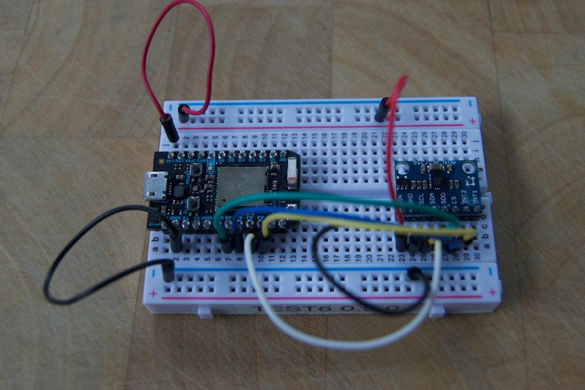

# sendaccel
*Proof-of-concept for streaming accelerometer data off a Particle Photon in real time using TCP.*

A [Particle community form post] (https://community.particle.io/t/gathering-continuous-data-at-200-hz/23435) got me thinking  about how fast can you reasonably send sensor data off the Photon. To make a somewhat plausible proof-of-concept I connected an ADXL362 accelerometer to a Photon. It’s the sensor in the [Electron Sensor Kit] (https://docs.particle.io/datasheets/particle-shields/#electron-sensor-kit), but it’s just a basic SPI 12-bit X, Y, Z accelerometer.

I set it up to acquire 200 samples per second to a local server. It worked!

The accelerometer is programmed to gather the samples at the exact sample rate, independent of what the Photon is doing. It stores them in an on-sensor FIFO (1 Kbytes). The main loop pull samples out of the FIFO using asynchronous SPI DMA into a larger secondary buffer (128 buffers of 128 bytes each, 16K total). And finally the sender sends the data off by TCP one buffer at a time. All of these things run somewhat independently.

It’s only 1200 bytes per second, well within the capabilities of the Photon. It even works fine connecting to a server on the Internet. And even bumped up to 400 samples per second, the maximum supported by the sensor. The way the code is designed, if there’s a momentary network hiccup, the secondary data buffers accumulate, but as soon as the network comes back, it catches up. You could add many more buffers, if you have available RAM.

Here’s the code. There’s the Photon C++ source, an experimental partially implemented ADXL362 library that does SPI DMA, and a server program written in node.js.

**WARNING:** This is a proof-of-concept. The code likely has bugs, and it’s barely been tested! It’s not really intended to be the basis of an actual product!
https://github.com/rickkas7/sendaccel
